# EAP — Fase de Visibilidade de Dados · Jiló (DaJu Alimentação)

> Estrutura Analítica de Projeto (EAP/WBS) para a fase de **captação e instrumentação de dados** do ecossistema Jiló.
> **Não é projeto novo** — é uma fase de trabalho dentro da plataforma já em produção (branch `main`).
> As sprints abaixo entram na **esteira de execução existente do Jiló**, para rodar junto com o roadmap.
> Fainow · 2026-06-26 · Baseado em leitura do código real (`FainowAI/jilo-replica-prime`) + dados ao vivo (Shopify + Supabase) + pesquisa de implementação (PostHog/GA4).

---

## 0. Objetivo da fase

Trazer **visibilidade de dados** para o negócio em três frentes, encaixadas como sprints na esteira existente:

1. **Captação Shopify** — garantir que o dado do cliente chegue à Shopify (cadastro → customer com endereço nativo) e habilitar a captação de **pedidos** (registrar webhooks que nunca foram ligados).
2. **PostHog** — instrumentação de produto (eventos, funil, replay, flags).
3. **GA4** — pageview, aquisição e canais (marketing).

**Definition of Done da fase:** dado **fluindo e validado em QA**. Montar dashboards/relatórios de análise é uma **fase seguinte** (fora deste escopo).

---

## 1. Diagnóstico que motivou a fase (estado real, lido ao vivo)

| Fonte | Achado | Implicação |
|-------|--------|------------|
| Shopify `jnutg9-u2` | 27 produtos OK (preço + tags por grupo) | Produto já é capturado — sem trabalho |
| Shopify | **2 clientes, ambos SEM tags `jilo-customer`/`source:supabase`**, `phone: null` | Vieram do **checkout**, não do customer-sync |
| Supabase `hofohxvizlmawgkinwwz` | **6 cadastros, 0 com `shopify_customer_id`** | O customer-sync **nunca completou** para ninguém |
| Supabase | `orders` / `order_items` / `webhook_events` **VAZIAS** | Webhooks Shopify nunca foram registrados → **zero dado de pedido** |
| Código | `shopify-webhook-receiver` já implementado e deployado (HMAC + idempotência + `orders/create`/`paid`/`fulfilled` + dispatch Uber) | Frente de pedidos é **registrar + endurecer**, não construir |
| Código | `shopify-customer-sync` dispara **só** no save de perfil e envia só email/nome/telefone | Quem cadastra e não edita perfil nunca sincroniza |
| Código | `App.tsx`/`main.tsx` sem nenhuma instrumentação; `<head>` estático (R31) | Analytics é **greenfield** dentro do front |

**Leitura estratégica:** a maior parte da plumbing já existe. Esta fase é predominantemente de **ativação e instrumentação**, não de construção do zero — por isso cabe como sprints curtas na esteira, sem fundação.

---

## 2. Decisões travadas (gate de negócio + briefing de planejamento)

| # | Decisão | Valor |
|---|---------|-------|
| D1 | Gatilho do customer-sync | Dispara no **signup E no save** (idempotente por `shopify_customer_id`) |
| D2 | O que enviar à Shopify | **Só campos nativos**: email, nome, telefone + **endereço default nativo**. **CPF não vai** (sem campo nativo; proibido metafield) |
| D3 | Pedidos nesta fase | **Sim** — registrar `orders/create` + `orders/paid` (+`fulfilled`) |
| D4 | PostHog person_profiles | **`always`** (todo visitante); `identify` no login com `user.id` |
| D5 | Ambientes + PII | Analytics **só em produção**; mascarar `:id` em URLs; nunca enviar CPF/email crus |
| D6 | GA4 × PostHog | **PostHog = produto**, **GA4 = aquisição**; sem GTM (gtag direto) |
| R1 | Quebra | **3 sprints**, 1 por frente |
| R2 | Sequência | **Shopify primeiro**, depois Analytics |
| R3 | Capacidade | **2 frentes paralelas** (Shopify backend ‖ Analytics frontend) |
| R4 | DoD | **Dado fluindo + validado em QA** (dashboards = fase seguinte) |

---

## 3. EAP — 3 níveis

Estrutura: **Fase → Sprint (nível 1) → Entregável (nível 2) → Work Package (nível 3)**.
Work packages marcados com **[MANUAL]** não são código (registro de webhook, env vars, provisionamento de conta).

```
FASE — Visibilidade de Dados (Jiló)
│
├── SPRINT A — Captação Shopify (cliente + endereço + pedidos)        [frente: backend/edge]
│   │
│   ├── A.1 — Sync de cliente completo
│   │     ├── A.1.1 — Estender payload do customer-sync com endereço nativo (MailingAddressInput)
│   │     ├── A.1.2 — Disparar o sync no signup (1ª sessão SIGNED_IN), além do save de perfil
│   │     └── A.1.3 — Validar tags jilo-customer/source:supabase + endereço no Admin
│   │
│   ├── A.2 — Captação de pedidos
│   │     ├── A.2.1 — [MANUAL] Registrar webhooks orders/create, orders/paid, orders/fulfilled
│   │     ├── A.2.2 — Endurecer orders/paid contra corrida com orders/create (upsert defensivo)
│   │     └── A.2.3 — (Opcional) Popular order_items normalizado a partir do payload
│   │
│   └── A.3 — QA & validação Sprint A
│         ├── A.3.1 — Pedido de teste → confirmar linha em webhook_events (processed=true) + orders
│         ├── A.3.2 — Cadastro de teste → customer nasce com tags + endereço nativo
│         └── A.3.3 — (Opcional) Backfill dos 6 cadastros órfãos (ou aguardar login natural)
│
├── SPRINT B — PostHog (instrumentação de produto)                    [frente: frontend]
│   │
│   ├── B.1 — Fundação do SDK
│   │     ├── B.1.1 — [MANUAL] Criar projeto PostHog + Project API Key + host
│   │     ├── B.1.2 — Instalar posthog-js + @posthog/react; env VITE_ prod-only
│   │     └── B.1.3 — PostHogProvider no main.tsx (person_profiles: always, defaults SPA)
│   │
│   ├── B.2 — Identificação & eventos
│   │     ├── B.2.1 — identify no login (user.id) + reset no logout
│   │     ├── B.2.2 — Eventos-chave do funil (ver Seção 5 — Dicionário de Eventos)
│   │     └── B.2.3 — Masking de PII (mascarar :id em URL, sem CPF/email cru)
│   │
│   └── B.3 — QA & validação Sprint B
│         ├── B.3.1 — Eventos aparecem no painel (Activity) em prod
│         └── B.3.2 — Anônimo→identificado conecta na mesma pessoa após login
│
├── SPRINT C — GA4 (aquisição & canais)                               [frente: frontend]
│   │
│   ├── C.1 — Fundação gtag
│   │     ├── C.1.1 — [MANUAL] Criar propriedade GA4 + Web Data Stream + Measurement ID
│   │     ├── C.1.2 — Carregar gtag prod-only com send_page_view:false; env VITE_
│   │     └── C.1.3 — RouteChangeTracker (pageview por rota no React Router v6)
│   │
│   ├── C.2 — Eventos de aquisição
│   │     ├── C.2.1 — Eventos-chave compartilhados com PostHog (Seção 5)
│   │     └── C.2.2 — Masking de PII na URL (mesmo helper da Sprint B)
│   │
│   └── C.3 — QA & validação Sprint C
│         ├── C.3.1 — Realtime do GA4 mostra pageview por rota
│         └── C.3.2 — DebugView confirma eventos-chave
│
└── ENCERRAMENTO — Documentação da fase
      └── Z.1 — Atualizar .claude/ (state.md + requirements.md + novos fluxo-*.md)
```

---

## 4. Detalhamento das sprints (entregável, dependências, DoD)

### SPRINT A — Captação Shopify
- **Frente:** backend/edge (não colide com Analytics).
- **Toca:** `supabase/functions/shopify-customer-sync/index.ts`, `src/contexts/AuthContext.tsx`, `supabase/functions/shopify-webhook-receiver/index.ts` + **[MANUAL]** Shopify Admin.
- **Não toca:** cartStore, fluxo de frete Uber, descontos kit/PIX, `_shared/shopify-admin-auth.ts`.
- **Dependência externa:** registro do webhook na Shopify (A.2.1) — bloqueia A.3.
- **Risco principal:** ordem de chegada dos webhooks (`paid` antes de `create`) → mitigado por A.2.2.
- **DoD:** pedido de teste cai em `orders` com `status=paid`; cadastro novo vira customer **com tags + endereço nativo**.

### SPRINT B — PostHog
- **Frente:** frontend. **Paralela à Sprint A** (arquivos distintos).
- **Toca:** `src/main.tsx`, `src/App.tsx`, `src/contexts/AuthContext.tsx` (só o ponto de identify/reset — coordenar com A.1.2, ver Seção 6), arquivos novos em `src/analytics/`.
- **Pré-requisito:** conta PostHog provisionada (B.1.1) + env vars no hosting.
- **DoD:** eventos-chave aparecem no painel em produção; jornada anônimo→identificado conecta no login.

### SPRINT C — GA4
- **Frente:** frontend. Roda **depois da Sprint B** (reusa o scaffolding de analytics: gate de ambiente, helper de eventos, masking).
- **Toca:** `index.html` (ou injeção via JS prod-only), `src/App.tsx` (RouteChangeTracker), `src/analytics/`.
- **Pré-requisito:** propriedade GA4 + Measurement ID (C.1.1) + env var.
- **DoD:** Realtime mostra pageview por rota; DebugView confirma os eventos-chave.

### ENCERRAMENTO — Documentação (Z.1)
- Atualizar `.claude/state.md`, `.claude/requirements.md` (novas regras: gatilho de sync, endereço nativo, webhooks ativos, política de analytics/PII) e criar `fluxo-analytics.md`.
- Sem isso, a próxima sessão de `feature-planner` parte de memória desatualizada.

---

## 5. Dicionário de eventos-chave (compartilhado PostHog + GA4)

Mesmos eventos nos dois sistemas (D6). Nomenclatura `[objeto] [verbo]`. **Sem PII nas propriedades.**

| Evento | Quando dispara | Propriedades (sem PII) |
|--------|----------------|------------------------|
| `produto visualizado` | abre página de produto | handle, grupo, preço |
| `item adicionado` | add ao carrinho | handle, grupo, qtd |
| `carrinho aberto` | abre o CartDrawer/`/carrinho` | nº itens, subtotal |
| `kit montado` | atinge múltiplo de 7 | tamanho do kit |
| `checkout iniciado` | clica "Ir para o Checkout" | nº itens, frete (grátis/pago), método entrega |
| `cadastro concluído` | signup com sucesso | — |
| `login efetuado` | login com sucesso | — |
| `endereço cadastrado` | cria endereço | UF, cidade, deliverable (bool) |

> A captura de pageview/cliques é **automática** (autocapture do PostHog e RouteChangeTracker do GA4). A lista acima é dos eventos **de negócio** que merecem nome próprio para o funil.

---

## 6. Pontos de coordenação entre as 2 frentes paralelas

As Sprints A e B rodam ao mesmo tempo, mas **ambas tocam `AuthContext.tsx`**:
- **Sprint A** adiciona, no `onAuthStateChange`, o disparo do `customer-sync` no `SIGNED_IN`.
- **Sprint B** adiciona, no mesmo handler, o `posthog.identify(user.id)` no `SIGNED_IN` e `posthog.reset()` no logout.

**Regra de coordenação:** combinar quem encosta primeiro no `AuthContext.tsx`. Recomendação: a Sprint A faz a alteração base do handler; a Sprint B adiciona as chamadas de analytics no mesmo bloco (ou via um `useEffect` separado que observa `user`). Evita conflito de merge no único arquivo compartilhado.

O `package.json` só é tocado pela Sprint B (adiciona `posthog-js`, `@posthog/react`). A Sprint A não mexe em deps. Sprint C não adiciona dep (gtag é script, sem lib).

---

## 7. Sequência na esteira & paralelização

```mermaid
gantt
    dateFormat  X
    axisFormat %s
    section Frente Backend
    Sprint A — Captação Shopify      :a1, 0, 3
    section Frente Frontend
    Sprint B — PostHog               :b1, 0, 3
    Sprint C — GA4                   :c1, after b1, 2
    section Fechamento
    Z.1 — Docs .claude/              :z1, after a1 c1, 1
```



- **Início simultâneo:** Sprint A (backend) e Sprint B (frontend) começam juntas — frentes independentes.
- **Sprint C** entra após a B (reusa scaffolding de analytics).
- **Z.1 (docs)** fecha a fase, depois que A e C terminam e o QA passou.
- **Ordem de prioridade de negócio (R2):** se houver disputa por foco, **Shopify primeiro** — é a frente que destrava dado de pedido/receita.

> Estimativas de duração foram deixadas de fora propositalmente — o time encaixa cada sprint na própria cadência da esteira. A EAP entrega **estrutura e dependências**, não cronograma fechado.

---

## 8. Riscos & mitigação

| Risco | Sprint | Mitigação |
|-------|--------|-----------|
| `orders/paid` chega antes de `orders/create` → pedido sem status | A | A.2.2 (upsert defensivo no handler) |
| Webhook registrado com secret divergente → HMAC falha (401) | A | Usar o secret padrão da app (já = `SHOPIFY_WEBHOOK_SECRET`); validar com pedido teste |
| Endereço inválido bloqueia criação do customer | A | Fail-soft: endereço é incremental, erro não impede o sync |
| `person_profiles: always` escala custo com tráfego | B | Decisão consciente (D4); revisitar se volume crescer (vira toggle) |
| Analytics vazando em dev/preview poluindo dados | B/C | Gate prod-only (D5) — só ativa em `jilomarmitas.com` |
| PII em URL (`/conta/pedidos/:id`) indo pro analytics | B/C | Masking de `:id` antes de enviar (D5) |
| Conflito de merge no `AuthContext.tsx` (2 frentes) | A+B | Regra de coordenação da Seção 6 |
| 6 cadastros órfãos seguem sem `shopify_customer_id` | A | A.3.3 — backfill opcional OU login natural (S2 re-dispara) |

---

## 9. Fora de escopo desta fase (backlog explícito)

- Dashboards/relatórios de análise sobre os dados captados (PostHog Insights, GA4 Explorations, painel próprio) — **fase seguinte**.
- Integração Bling ERP (consome o pedido já captado).
- HMAC do `uber-webhook-receiver` e validação server-side de `shipping_fee_cents` (débitos de segurança pré-existentes — Sprint de hardening própria).
- `order_items` normalizado é **opcional** aqui (A.2.3); se não entrar, `line_items` jsonb segue servindo.

---

## 10. Encaixe no Ciclo Fainow

Esta fase é **Iteração (Fase 6)** sobre um produto já documentado. Após o encerramento (Z.1):
- Se as sprints acumularem código órfão → `codebase-cleanup`.
- Cada frente, na hora de executar, vira prompts via `feature-planner` (lê o código antes de gerar) — **não** este documento. A EAP define O QUE e em QUE ORDEM; o feature-planner gera o COMO no momento da execução.